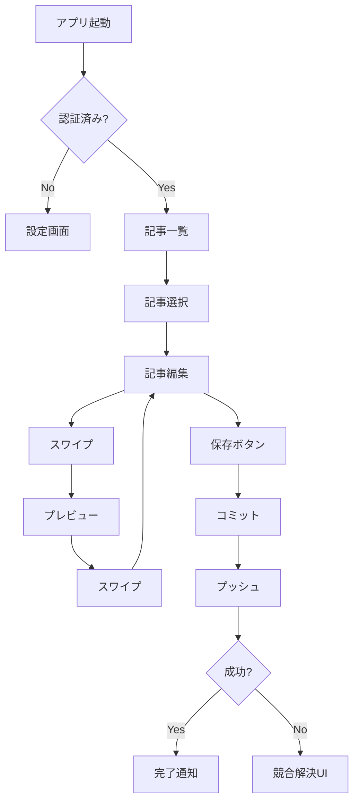

# Fokus. Mobile - UI/UXデザイン仕様書

**バージョン**: 1.0.0
**最終更新**: 2026-01-21
**デザイン原則**: Focus-Driven, Gesture-First, Offline-Ready

---

## 1. デザイン哲学

### 1.1 コンセプト：「フォーカス・ポケット」

スマートフォンの制約（小画面・片手操作）を**強み**に変える。デスクトップの多機能性ではなく、**モバイル特有の集中力**を最大化。

#### デザイン原則
1. **ミニマリズム**: 必要な要素だけ表示、装飾を排除
2. **片手操作**: 親指で全操作完結
3. **フロー状態**: 編集モードでは通知ゼロ、没入体験
4. **即座性**: 起動→編集→保存が5タップ以内

### 1.2 インスピレーション

| 参考アプリ | 取り入れる要素 |
|-----------|---------------|
| **iA Writer** | フォーカスモード、タイポグラフィ |
| **Bear** | タグシステム、スムーズアニメーション |
| **Ulysses** | ライブラリUI、目標設定 |
| **Craft** | カード型レイアウト、ジェスチャー |
| **GitHub Mobile** | Git操作のシンプル化 |

---

## 2. カラーシステム

### 2.1 パレット（デスクトップ版準拠 + モバイル拡張）

#### ライトモード
```css
/* 既存 */
--background: #faf8f5;
--foreground: #3d3d3d;
--accent: #7b6d5d;
--muted: #ebe7e0;
--border: #ddd8d0;

/* モバイル追加 */
--card-bg: #ffffff;
--card-shadow: 0 2px 8px rgba(0, 0, 0, 0.08);
--overlay: rgba(0, 0, 0, 0.5);
--success: #4caf50;  /* 同期成功 */
--error: #f44336;    /* エラー */
--warning: #ff9800;  /* 競合 */
--fab-primary: #7b6d5d;
--fab-shadow: 0 4px 12px rgba(123, 109, 93, 0.4);
```

#### ダークモード
```css
/* 既存 */
--background: #1a1a1a;
--foreground: #e0dcd5;
--accent: #c9a87c;
--muted: #2d2d2d;
--border: #404040;

/* モバイル追加 */
--card-bg: #2d2d2d;
--card-shadow: 0 2px 8px rgba(0, 0, 0, 0.3);
--overlay: rgba(0, 0, 0, 0.7);
--success: #66bb6a;
--error: #ef5350;
--warning: #ffa726;
--fab-primary: #c9a87c;
--fab-shadow: 0 4px 12px rgba(201, 168, 124, 0.4);
```

### 2.2 アクセシビリティ

- **コントラスト比**: 最小4.5:1（WCAG AA）
- **カラーブラインド対応**: アイコン併用
- **ダークモード**: ブルーライトカット（夜間読書対応）

---

## 3. タイポグラフィ

### 3.1 フォントスタック

```css
/* システムフォント（パフォーマンス優先） */
--font-system: -apple-system, BlinkMacSystemFont, "Segoe UI",
               Roboto, "Helvetica Neue", sans-serif;

/* エディタ用モノスペース */
--font-editor: ui-monospace, "SF Mono", Menlo, Monaco, Consolas,
               "Liberation Mono", "Courier New", monospace;

/* 日本語（Noto Sans JP ウェイト300-700） */
--font-ja: "Noto Sans JP", "Hiragino Sans", "Yu Gothic", sans-serif;
```

### 3.2 スケール（モバイル最適化）

| 要素 | サイズ | ウェイト | 用途 |
|------|--------|---------|------|
| **Display** | 1.75rem (28px) | 700 | ページタイトル |
| **H1** | 1.5rem (24px) | 700 | セクション見出し |
| **H2** | 1.25rem (20px) | 600 | サブ見出し |
| **Body** | 0.9375rem (15px) | 400 | 本文、リスト |
| **Caption** | 0.8125rem (13px) | 400 | メタ情報 |
| **Label** | 0.75rem (12px) | 500 | ラベル、タグ |

### 3.3 行高・レターススペーシング

```css
/* 読みやすさ重視 */
--line-height-tight: 1.25;   /* 見出し */
--line-height-normal: 1.6;   /* 本文 */
--line-height-relaxed: 1.8;  /* エディタ */

/* 詰め組 */
--letter-spacing-tight: -0.02em;   /* 大見出し */
--letter-spacing-normal: 0;        /* 本文 */
--letter-spacing-wide: 0.05em;     /* ラベル */
```

---

## 4. レイアウト

### 4.1 グリッドシステム

```
┌─────────────────────────────────┐
│ Safe Area (iOS Notch対応)      │
│ ┌─────────────────────────────┐│
│ │ Header (56dp)               ││
│ ├─────────────────────────────┤│
│ │                             ││
│ │ Content Area                ││
│ │ (全画面 - Header - TabBar)  ││
│ │                             ││
│ │ Padding: 16dp (左右)        ││
│ │                             ││
│ ├─────────────────────────────┤│
│ │ Tab Bar (56dp)              ││
│ └─────────────────────────────┘│
│ Safe Area Bottom               │
└─────────────────────────────────┘
```

### 4.2 スペーシング（8dpベース）

```
4dp   (xs)   - タイトボックス内
8dp   (sm)   - コンポーネント内マージン
12dp  (md)   - カード内パディング
16dp  (base) - 画面左右パディング
24dp  (lg)   - セクション間
32dp  (xl)   - 大セクション間
48dp  (2xl)  - ヒーローセクション
```

### 4.3 タッチターゲット

- **最小サイズ**: 44x44pt (iOS) / 48x48dp (Android)
- **推奨サイズ**: 56x56pt/dp（FAB、主要ボタン）
- **間隔**: 8dp以上

---

## 5. コンポーネント設計

### 5.1 ナビゲーション

#### タブバー（ボトムナビゲーション）
```
┌───────────────────────────────────┐
│ 📝 記事 | 📂 一覧 | ⚙️ 設定      │
│  (選択状態: アクセントカラー)      │
└───────────────────────────────────┘

状態:
- Default: グレー (#9e9e9e)
- Active: アクセントカラー (#7b6d5d / #c9a87c)
- アニメーション: Scale(1.1) + 色遷移(200ms)
```

#### ヘッダーバー
```
┌─────────────────────────────────────┐
│ ◀ [戻る]  [タイトル]     [アクション] │
│                                     │
│ ← 44pt   Center align   → 44pt     │
└─────────────────────────────────────┘

バリエーション:
1. 記事編集: ◀戻る | タイトル | 💾保存
2. 一覧: ☰メニュー | 記事一覧 | 🔍検索
3. 設定: ◀戻る | 設定 | ✓完了
```

### 5.2 カードコンポーネント

#### 記事カード（一覧画面）
```css
.article-card {
  background: var(--card-bg);
  border-radius: 12px;
  padding: 16dp;
  margin-bottom: 12dp;
  box-shadow: var(--card-shadow);

  /* タップフィードバック */
  transition: transform 0.15s ease,
              box-shadow 0.15s ease;
}

.article-card:active {
  transform: scale(0.98);
  box-shadow: 0 1px 4px rgba(0, 0, 0, 0.12);
}

/* 構造 */
┌───────────────────────────────┐
│ [タイトル]           [下書き] │
│ 2026年1月21日 | 1,234文字    │
│ #tag1 #tag2                   │
└───────────────────────────────┘
```

#### Frontmatterカード（編集画面）
```css
.frontmatter-card {
  background: var(--card-bg);
  border-radius: 12px;
  padding: 12dp;
  margin: 16dp 16dp 0 16dp;

  /* 折りたたみアニメーション */
  transition: max-height 0.3s cubic-bezier(0.4, 0, 0.2, 1);
}

/* 展開状態 */
┌─────────────────────────────────┐
│ Frontmatter         ▼           │
│ ───────────────────────────────│
│ タイトル: [入力フィールド]      │
│ 公開日時: [日付ピッカー]        │
│ タグ: #tag1 #tag2 [+追加]      │
│ 下書き: [トグルスイッチ] ON    │
└─────────────────────────────────┘

/* 折りたたみ状態 */
┌─────────────────────────────────┐
│ Frontmatter         ▶           │
└─────────────────────────────────┘
```

### 5.3 フローティングアクションボタン (FAB)

#### メインFAB（記事編集画面）
```css
.fab-main {
  position: fixed;
  bottom: 72dp;  /* Tab Bar + 16dp */
  right: 16dp;
  width: 56dp;
  height: 56dp;
  border-radius: 28dp;
  background: var(--fab-primary);
  box-shadow: var(--fab-shadow);

  /* アイコン */
  display: flex;
  align-items: center;
  justify-content: center;

  /* リップルエフェクト */
  overflow: hidden;
}

/* 展開時（SpeedDial） */
.fab-speedial {
  /* メインFABから放射状に展開 */
  animation: fab-expand 0.2s cubic-bezier(0.4, 0, 0.2, 1);
}

┌─────────────────────────┐
│         📷              │
│        /                │
│      💾                 │
│     /  \                │
│   🔗    📝              │
│                         │
└─────────────────────────┘

アクション:
💾 保存 (メイン)
📷 画像挿入
🔗 リンク挿入
📝 Markdownショートカット
```

### 5.4 エディタツールバー

#### フローティングツールバー（テキスト選択時）
```css
.editor-toolbar {
  position: absolute;  /* 選択範囲の上に表示 */
  background: var(--foreground);
  border-radius: 8dp;
  padding: 8dp;
  box-shadow: 0 4px 12px rgba(0, 0, 0, 0.2);

  /* ツール */
  display: flex;
  gap: 12dp;
}

┌─────────────────────────────────┐
│ [選択テキスト]                  │
└─────────────────────────────────┘
        ↑
┌───────────────────────┐
│ B I ** [] 🔗 📷      │
└───────────────────────┘

ボタン:
B  - 太字 (**text**)
I  - 斜体 (*text*)
** - 見出し (# text)
[] - リンク ([text](url))
🔗 - URLペースト
📷 - 画像挿入
```

### 5.5 Git ステータスバー

```css
.git-status-bar {
  position: fixed;
  bottom: 56dp;  /* Tab Barの直上 */
  left: 0;
  right: 0;
  height: 32dp;
  background: var(--muted);
  display: flex;
  align-items: center;
  padding: 0 16dp;

  /* 状態に応じた色 */
  &.synced { background: var(--success); }
  &.syncing { background: var(--warning); }
  &.error { background: var(--error); }
}

┌───────────────────────────────────┐
│ ✓ 同期完了 | 2分前 | 📶 Wi-Fi    │
└───────────────────────────────────┘

状態表示:
✓ 同期完了 (緑)
⟳ 同期中... (黄)
✗ 競合検出 (赤)
⚠ オフライン (グレー)
```

---

## 6. インタラクション

### 6.1 ジェスチャー

#### スワイプジェスチャー
```
[エディタ]  ←─────  [プレビュー]
              スワイプ

実装:
- Threshold: 100dp
- Velocity: 0.5dp/ms
- アニメーション: Spring (damping: 0.8, stiffness: 100)
```

#### プルトゥリフレッシュ
```
     ↓ 引っ張る
┌─────────────────┐
│ ⟳ リフレッシュ  │
└─────────────────┘
     ↓
[記事一覧更新]

実装:
- Overscroll: 80dp
- インジケーター: Circular Progress
```

#### 長押しメニュー
```
[記事カード]
     ↓ 長押し (500ms)
┌─────────────────┐
│ ✏️ 編集         │
│ 🗑️ 削除         │
│ 📋 複製         │
│ 🏷️ タグ編集     │
└─────────────────┘
```

### 6.2 アニメーション

#### ページ遷移
```css
/* スライド遷移 */
.page-enter {
  transform: translateX(100%);
  opacity: 0;
}

.page-enter-active {
  transform: translateX(0);
  opacity: 1;
  transition: all 0.3s cubic-bezier(0.4, 0, 0.2, 1);
}

/* フェード遷移（モーダル） */
.modal-enter {
  opacity: 0;
  transform: scale(0.95);
}

.modal-enter-active {
  opacity: 1;
  transform: scale(1);
  transition: all 0.2s ease-out;
}
```

#### マイクロインタラクション
```css
/* ボタンタップ */
button:active {
  transform: scale(0.96);
  transition: transform 0.1s ease;
}

/* チェックボックス */
.checkbox-checked {
  animation: check-bounce 0.3s ease;
}

@keyframes check-bounce {
  0% { transform: scale(0); }
  50% { transform: scale(1.2); }
  100% { transform: scale(1); }
}

/* FAB展開 */
.fab-item {
  animation: fab-item-appear 0.15s ease-out backwards;
}

@keyframes fab-item-appear {
  from {
    opacity: 0;
    transform: translateY(20px) scale(0.8);
  }
  to {
    opacity: 1;
    transform: translateY(0) scale(1);
  }
}
```

### 6.3 フィードバック

#### ハプティック（振動）
```dart
// 軽いタップ
HapticFeedback.lightImpact();

// 成功
HapticFeedback.mediumImpact();

// エラー
HapticFeedback.heavyImpact();

// 選択
HapticFeedback.selectionClick();
```

#### 音声フィードバック（オプション）
- 保存完了: チャイム音（短い）
- 同期完了: 確認音
- エラー: 警告音

---

## 7. 画面設計詳細

### 7.1 記事一覧画面

```
┌─────────────────────────────────────┐
│ ☰          記事一覧          🔍     │  ← Header (56dp)
├─────────────────────────────────────┤
│ [検索バー]                          │  ← 48dp
├─────────────────────────────────────┤
│ [すべて] [下書き] [公開済み]       │  ← Filter Chips (40dp)
├─────────────────────────────────────┤
│                                     │
│ ┌─────────────────────────────────┐│
│ │ 記事タイトル           [下書き] ││  ← Card (80dp)
│ │ 2026-01-21 | 1,234文字         ││
│ │ #tag1 #tag2                     ││
│ └─────────────────────────────────┘│
│                                     │
│ ┌─────────────────────────────────┐│
│ │ 別の記事                        ││
│ │ 2026-01-20 | 567文字           ││
│ │ #tag3                           ││
│ └─────────────────────────────────┘│
│                                     │
│ ... (スクロール可能)                │
│                                     │
│                             ┌─────┐│
│                             │ ➕  ││  ← FAB (56dp)
│                             └─────┘│
├─────────────────────────────────────┤
│ 📝 記事 | 📂 一覧 | ⚙️ 設定        │  ← Tab Bar (56dp)
└─────────────────────────────────────┘
```

### 7.2 記事編集画面

```
┌─────────────────────────────────────┐
│ ◀ 戻る   記事タイトル         💾   │  ← Header
├─────────────────────────────────────┤
│ [Frontmatter]              ▼       │  ← Collapsible Card
├─────────────────────────────────────┤
│                                     │
│ # 見出し1                           │
│                                     │
│ ここに本文を入力...                 │
│                                     │
│          │
│                                     │
│ - リスト項目1                       │
│ - リスト項目2                       │
│                                     │
│ ... (エディタエリア、スクロール)    │
│                                     │
│                             ┌─────┐│
│                             │ 💾  ││  ← FAB
│                             └─────┘│
├─────────────────────────────────────┤
│ ✓ 同期完了 | 2分前             📶  │  ← Git Status Bar
├─────────────────────────────────────┤
│ 📝 記事 | 📂 一覧 | ⚙️ 設定        │  ← Tab Bar
└─────────────────────────────────────┘

← スワイプでプレビュー
```

### 7.3 プレビュー画面

```
┌─────────────────────────────────────┐
│ ◀ 戻る      プレビュー         ✏️  │  ← Header
├─────────────────────────────────────┤
│                                     │
│ # レンダリングされた見出し          │
│                                     │
│ 本文がHTMLとして表示されます。      │
│ **太字**、*斜体*、リンクなど       │
│ すべて正しく表示。                  │
│                                     │
│ [画像表示]                          │
│                                     │
│ - リスト項目                        │
│ - リスト項目                        │
│                                     │
│ ... (スクロール可能)                │
│                                     │
└─────────────────────────────────────┘

→ スワイプでエディタ
```

### 7.4 設定画面

```
┌─────────────────────────────────────┐
│ ◀ 戻る          設定                │  ← Header
├─────────────────────────────────────┤
│ リポジトリ設定                      │
│ ───────────────────────────────────│
│ リポジトリURL                       │
│ https://github.com/user/blog.git    │
│                                     │
│ 記事パス                            │
│ src/data/blog                       │
│                                     │
│ Git認証                             │
│ ───────────────────────────────────│
│ Personal Access Token               │
│ [••••••••••••••••] 🔄 更新         │
│                                     │
│ エディタ設定                        │
│ ───────────────────────────────────│
│ フォントサイズ        [15pt] ─────  │
│ 自動保存              [ON] トグル   │
│ オフライン編集        [ON] トグル   │
│                                     │
│ 同期設定                            │
│ ───────────────────────────────────│
│ Wi-Fi時のみ同期       [ON] トグル   │
│ バックグラウンド同期  [OFF] トグル  │
│                                     │
│ アプリ情報                          │
│ ───────────────────────────────────│
│ バージョン 1.0.0                    │
│ ライセンス MIT                      │
│                                     │
└─────────────────────────────────────┘
```

---

## 8. ダークモード

### 8.1 切替方法

1. **自動**: システム設定連動（デフォルト）
2. **手動**: 設定画面でトグル
3. **スケジュール**: 日没〜日の出（オプション）

### 8.2 デザイン差異

```css
/* ライトモード: 柔らかい影 */
.card-light {
  box-shadow: 0 2px 8px rgba(0, 0, 0, 0.08);
}

/* ダークモード: より強い影 */
.card-dark {
  box-shadow: 0 2px 8px rgba(0, 0, 0, 0.3);
  border: 1px solid rgba(255, 255, 255, 0.1);  /* 輪郭追加 */
}
```

### 8.3 画像対応

```css
/* ダークモードで画像を暗く */
@media (prefers-color-scheme: dark) {
  img {
    opacity: 0.9;
    filter: brightness(0.9);
  }
}
```

---

## 9. アクセシビリティ

### 9.1 VoiceOver/TalkBack対応

```dart
// アクセシビリティラベル例
Semantics(
  label: '記事タイトル: $title',
  hint: 'タップして記事を開く',
  button: true,
  child: ArticleCard(article: article),
)
```

### 9.2 Dynamic Type（フォントスケーリング）

```dart
// システム設定に応じた文字サイズ
Text(
  'テキスト',
  style: TextStyle(
    fontSize: 15.sp,  // スクリーンサイズ対応
  ).useSystemTextScaling(),
)
```

### 9.3 ハイコントラストモード

```css
/* iOS: Increase Contrast */
@media (prefers-contrast: high) {
  .card {
    border: 2px solid var(--border);
  }

  .button {
    border: 2px solid var(--foreground);
  }
}
```

---

## 10. パフォーマンス最適化

### 10.1 画像読み込み

```dart
// 段階的読み込み
CachedNetworkImage(
  imageUrl: article.ogImage,
  placeholder: (context, url) => ShimmerPlaceholder(),
  fadeInDuration: Duration(milliseconds: 200),
  memCacheWidth: 600,  // リサイズ
)
```

### 10.2 リスト最適化

```dart
// 仮想スクロール
ListView.builder(
  itemCount: articles.length,
  itemBuilder: (context, index) {
    return ArticleCard(article: articles[index]);
  },
  cacheExtent: 200,  // 先読み範囲
)
```

---

## 11. プロトタイプ

### 11.1 Figma設計図

```
[Figma Link]
https://www.figma.com/file/...

フレーム:
- 01_記事一覧
- 02_記事編集
- 03_プレビュー
- 04_設定
- 05_コンポーネント集
```

### 11.2 インタラクションフロー



---

## 12. 変更履歴

| バージョン | 日付 | 変更内容 |
|-----------|------|----------|
| 1.0.0 | 2026-01-21 | 初版作成 |
