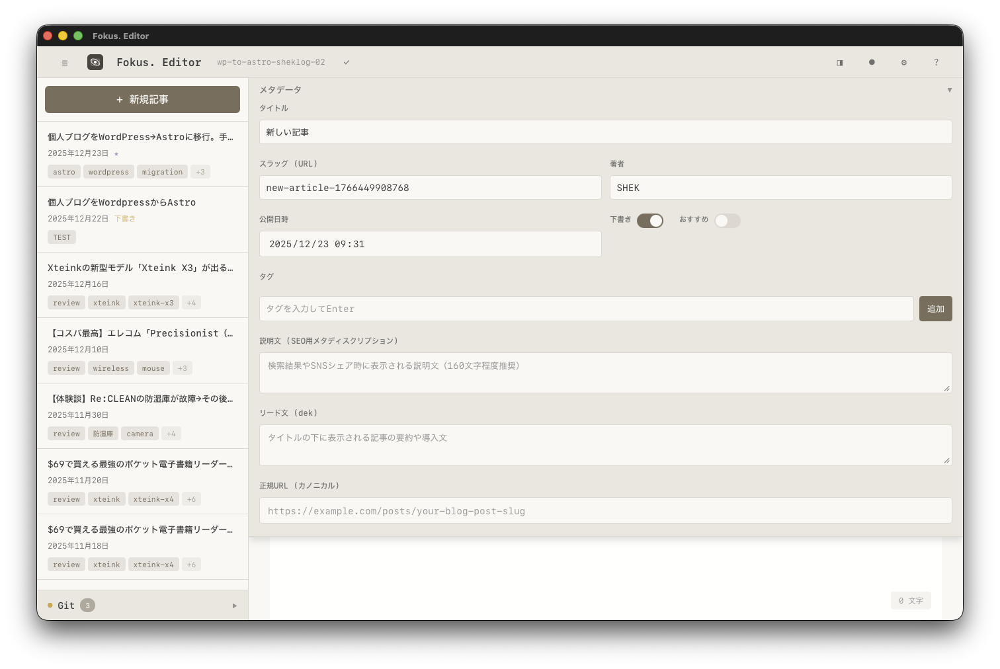

# Fokus. Editor

[🇺🇸 English](#english) | [🇯🇵 日本語](#日本語)



---

## English

**A minimal MDX editor for Astro blogs**

### Features

- ✍️ **MDX Support** - Full Frontmatter field support for Astro blogs
- 👁️ **Real-time Preview** - Instant preview as you write
- 🔄 **Git Integration** - Commit and push within the app
- ⚡ **Lightweight & Fast** - Built with Rust + Tauri
- 🌙 **Dark/Light Mode** - Automatically follows system settings

### Download

- [macOS (Apple Silicon)](https://github.com/SHEK2349/fokus-mdx-editor/releases)

### How to Use

#### 1. Prepare Your Repository

Fokus Editor requires an **Astro blog repository**.

```bash
git clone https://github.com/your-username/your-blog.git
```

> **Important**: The repository must have an `origin` remote configured.

#### 2. Initial Setup

After launching the app, configure the following:

| Setting | Description | Example |
|---------|-------------|---------|
| Repository Path | Root directory of your Git repository | `/Users/you/my-blog` |
| Articles Path | Directory containing MDX files (relative) | `src/data/blog` |

#### 3. Edit and Publish

1. Select an article from the sidebar, or click "New Article"
2. Edit in the editor
3. Save with `Cmd + S`
4. Enter a commit message and commit in the Git panel
5. Click "Push" to send to remote

#### 4. Deploy (Cloudflare Pages, etc.)

Push destinations follow the repository's `origin` remote.

**For Cloudflare Pages or Vercel:**
1. Connect your GitHub repository to Cloudflare Pages/Vercel
2. Push from Fokus Editor → Deployment starts automatically

### Tech Stack

- **Frontend**: React + TypeScript + Vite
- **Backend**: Rust (Tauri Commands)
- **Editor**: MDXEditor
- **Preview**: react-markdown

---

## 日本語

**Astroブログのためのミニマルな MDX エディタ**

### 特徴

- ✍️ **MDX対応** - Astroブログの全Frontmatterフィールドをサポート
- 👁️ **リアルタイムプレビュー** - 書いた内容を即座にプレビュー
- 🔄 **Git統合** - コミット・プッシュがアプリ内で完結
- ⚡ **軽量・高速** - Rust + Tauriで構築、ネイティブ並みの高速動作
- 🌙 **ダーク/ライトモード** - システム設定に自動対応

### ダウンロード

- [macOS (Apple Silicon)](https://github.com/SHEK2349/fokus-mdx-editor/releases)

### 使い方

#### 1. リポジトリの準備

Fokus Editorを使用するには、**Astroブログのリポジトリが必要**です。

```bash
git clone https://github.com/あなたのユーザー名/あなたのブログ.git
```

> **重要**: リポジトリに`origin`リモートが設定されている必要があります。

#### 2. 初回設定

アプリ起動後、以下を設定します：

| 項目 | 説明 | 例 |
|------|------|-----|
| リポジトリパス | Gitリポジトリのルートディレクトリ | `/Users/you/my-blog` |
| 記事パス | MDXファイルがあるディレクトリ（相対パス） | `src/data/blog` |

#### 3. 記事の編集と公開

1. 左サイドバーから記事を選択、または「新規記事」をクリック
2. エディタで記事を編集
3. `Cmd + S` で保存
4. Gitパネルでコミットメッセージを入力してコミット
5. 「プッシュ」ボタンでリモートに送信

#### 4. デプロイ（Cloudflare Pages等）

プッシュ先はリポジトリの`origin`リモートになります。

**Cloudflare PagesやVercelと連携する場合：**
1. GitHubリポジトリをCloudflare Pages/Vercelに接続
2. Fokus Editorからプッシュ → 自動的にデプロイが開始

### 技術スタック

- **フロントエンド**: React + TypeScript + Vite
- **バックエンド**: Rust (Tauri Commands)
- **エディタ**: MDXEditor
- **プレビュー**: react-markdown

---

## Development / 開発

### Requirements / 必要環境
- Node.js 18+
- Rust 1.70+
- macOS 11+

### Setup / セットアップ

```bash
npm install
npm run tauri dev
npm run tauri build
```

## License / ライセンス

MIT License - See [LICENSE](LICENSE)

## Author / 作者

SHEK - [Blog](https://shek-fokus.com) | [X](https://x.com/Shek_Fokus)
