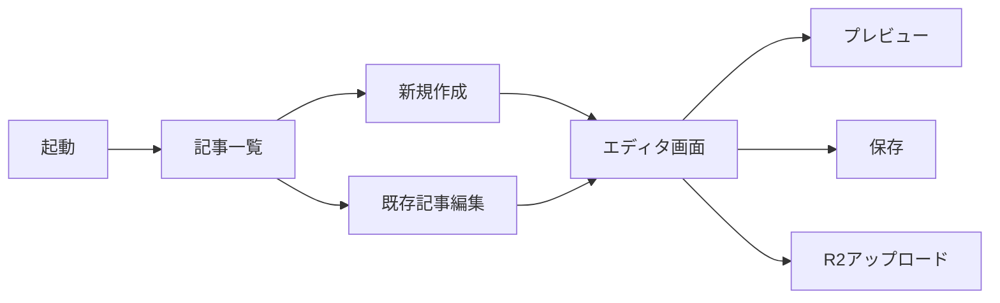

# MDXエディタ アプリケーション 要件定義書

## 1. プロジェクト概要

### 目的
Astroブログ（Fokus.）用のMDXファイルを効率的に作成・編集するためのデスクトップアプリケーションを開発する。

### 対象ユーザー
- ブログ運営者（SHEK）
- 技術的知識を持つライター

---

## 2. 機能要件

### 2.1 コア機能

| 機能 | 優先度 | 説明 |
|------|--------|------|
| Frontmatter編集 | 必須 | GUI形式でメタデータを入力・編集 |
| 本文エディタ | 必須 | Markdown/MDX対応のテキストエディタ |
| ライブプレビュー | 必須 | リアルタイムでHTMLプレビュー表示 |
| ファイル管理 | 必須 | 記事一覧の表示、検索、フィルタリング |
| 画像挿入 | 高 | ドラッグ&ドロップで画像挿入、パス自動生成 |
| タグ管理 | 高 | 既存タグからの選択、新規タグ追加 |
| 下書き/公開切替 | 高 | draft フラグの切り替え |
| R2アップロード | 中 | 画像をCloudflare R2に直接アップロード |

### 2.2 Frontmatterフィールド

```yaml
# 必須フィールド
title: string          # 記事タイトル
pubDatetime: datetime  # 公開日時
description: string    # SEO用説明文

# オプションフィールド
modDatetime: datetime  # 更新日時
featured: boolean      # おすすめ記事フラグ
draft: boolean         # 下書きフラグ
author: string         # 著者名（デフォルト: SHEK）
tags: string[]         # タグ一覧
dek: string           # リード文
ogImage: string       # OGP画像パス
canonicalURL: string  # 正規URL
hideEditPost: boolean # 編集リンク非表示
timezone: string      # タイムゾーン
```

### 2.3 エディタ機能詳細

- **シンタックスハイライト**: Markdown記法のカラーリング
- **ショートカット**: `Cmd+B`（太字）、`Cmd+I`（斜体）など
- **自動補完**: タグ入力時の候補表示
- **画像プレビュー**: エディタ内でのインライン画像表示
- **リンクカード対応**: URL入力時のリンクカード生成

---

## 3. 技術選定

### 3.1 推奨構成（案A: デスクトップアプリ）

| レイヤー | 技術 | 理由 |
|----------|------|------|
| 言語 | Python 3.11+ | ユーザー指定、豊富なライブラリ |
| GUIフレームワーク | **PyQt6** | 高機能、クロスプラットフォーム、リッチなUI |
| Markdownパーサー | `markdown-it-py` | 高速、拡張性が高い |
| HTMLレンダリング | QWebEngineView | Qt内蔵ブラウザでプレビュー |
| YAML処理 | `PyYAML` / `ruamel.yaml` | Frontmatter解析・生成 |
| 画像処理 | `Pillow` | リサイズ、WebP変換 |
| R2連携 | `boto3` (S3互換API) | Cloudflare R2アップロード |

### 3.2 代替構成（案B: Web UIベース）

| レイヤー | 技術 | 理由 |
|----------|------|------|
| バックエンド | **FastAPI** | 高速、型安全、OpenAPI自動生成 |
| フロントエンド | **React + Monaco Editor** | VSCode同等のエディタ体験 |
| プレビュー | remark/rehype | Astroと同じパイプライン |
| パッケージング | **Tauri** | 軽量デスクトップアプリ化 |

### 3.3 技術選定の比較

| 観点 | 案A (PyQt6) | 案B (FastAPI + React) |
|------|-------------|----------------------|
| 開発速度 | ★★★★☆ | ★★★☆☆ |
| UI品質 | ★★★☆☆ | ★★★★★ |
| パフォーマンス | ★★★★☆ | ★★★★★ |
| 保守性 | ★★★☆☆ | ★★★★☆ |
| Python純度 | ★★★★★ | ★★★☆☆ |

> **推奨**: Python重視であれば **案A (PyQt6)**、UI品質重視であれば **案B (FastAPI + Tauri)** を推奨

---

## 4. 画面設計

### 4.1 メイン画面レイアウト

```
┌─────────────────────────────────────────────────────────────┐
│ ツールバー: [新規] [保存] [プレビュー] [R2アップロード] [設定] │
├───────────┬─────────────────────────────────────────────────┤
│           │ ┌─────────────────────────────────────────────┐ │
│  サイド   │ │ Frontmatterエディタ (折りたたみ可能)        │ │
│  バー     │ │ タイトル: [________________]                │ │
│           │ │ 公開日:   [____-__-__] [__:__]              │ │
│  ・記事   │ │ タグ:     [tag1] [tag2] [+]                 │ │
│   一覧    │ │ 下書き:   [ ] featured: [ ]                 │ │
│           │ └─────────────────────────────────────────────┘ │
│  ・タグ   ├─────────────────────────────────────────────────┤
│   フィル │ │                                               │ │
│   タ     │ │              本文エディタ                     │ │
│           │ │      (Markdown/MDX シンタックスハイライト)    │ │
│  ・検索   │ │                                               │ │
│           │ │                                               │ │
├───────────┼─────────────────────────────────────────────────┤
│           │ │            ライブプレビュー                   │ │
│           │ │        (HTML/CSSレンダリング)                │ │
│           │ │                                               │ │
└───────────┴─────────────────────────────────────────────────┘
```

### 4.2 画面遷移



---

## 5. データフロー

### 5.1 ファイル操作

```
[ブログリポジトリ]
    └── src/data/blog/
        ├── _template.md      # テンプレート
        ├── article-1.mdx     # 記事ファイル
        ├── article-2.mdx
        └── ...

[アプリケーション]
    ├── 読み込み: MDXファイル → Frontmatter + 本文に分離
    ├── 編集: フォームUI + テキストエディタ
    └── 保存: Frontmatter + 本文を結合 → MDXファイル出力
```

### 5.2 画像アップロードフロー

```
1. 画像ファイルをドラッグ&ドロップ
2. WebP変換（オプション）
3. R2にアップロード
4. URLをクリップボードにコピー & エディタに挿入
```

---

## 6. 非機能要件

| 項目 | 要件 |
|------|------|
| 対応OS | macOS（主）、Windows（副） |
| 起動時間 | 3秒以内 |
| ファイル保存 | 自動保存（30秒間隔） |
| エラー処理 | 未保存時の確認ダイアログ |
| 設定 | ブログディレクトリパス、R2認証情報 |

---

## 7. 開発フェーズ

### Phase 1: MVP（最小限の製品）
- [ ] プロジェクトセットアップ
- [ ] Frontmatterエディタ
- [ ] 本文エディタ（シンプル）
- [ ] ファイル保存/読み込み
- [ ] 記事一覧表示

### Phase 2: エンハンスメント
- [ ] ライブプレビュー
- [ ] 画像ドラッグ&ドロップ
- [ ] タグオートコンプリート
- [ ] ショートカットキー

### Phase 3: R2連携
- [ ] R2アップロード機能
- [ ] 画像管理UI
- [ ] WebP自動変換

---

## 8. 質問事項（ユーザー確認）

1. **技術選定**: 案A（PyQt6純正Python）と案B（FastAPI + React/Tauri）のどちらが好みですか？
2. **優先機能**: Phase 1で追加したい機能はありますか？
3. **R2連携**: 初期から必須ですか、後回しでOKですか？
4. **配布形式**: 単独実行ファイル（.app）として配布したいですか？
5. **既存ツール連携**: Git操作（コミット・プッシュ）も統合したいですか？
